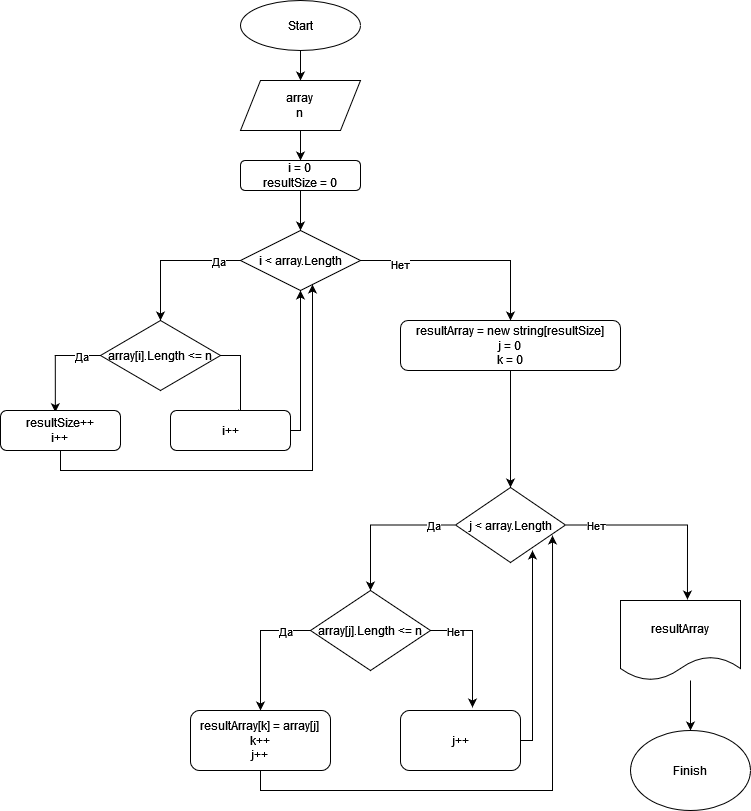

# Финальный проект

### Условие задания:
Напишите программу, которая из имеющегося массива строк формирует массив из строк, длина которых меньше либо равна 3 символа. Первоначальный массив можно ввести с клавиатуры, либо задать на старте выполнения алгоритма. При решении не рекомендуется пользоваться коллекциями, лучше обойтись исключительно массивами.

### Текстовое описание решения:
1. Задаем массив строк
2. В цикле считаем, сколько элементов меньше либо равно заданному количеству символов
3. Задаем новый массив(Итоговый) строк на количество элементов из подсчета в предыдущем пункте
4. Задаем вспомогательную переменную равную 0
5. В цикле перебираем элементы изначально заданного массива, проверям количество символов. Если количество символов меньше либо равно заданному, то присваиваем значение элемента исходного массива, элементу итогового массива с индексов вспомогательной переменной, после этого вспомогательную переменную увеличиваем на 1
6. По завершению работы цикла получаем нужный итоговый массив

### Блок-схема
